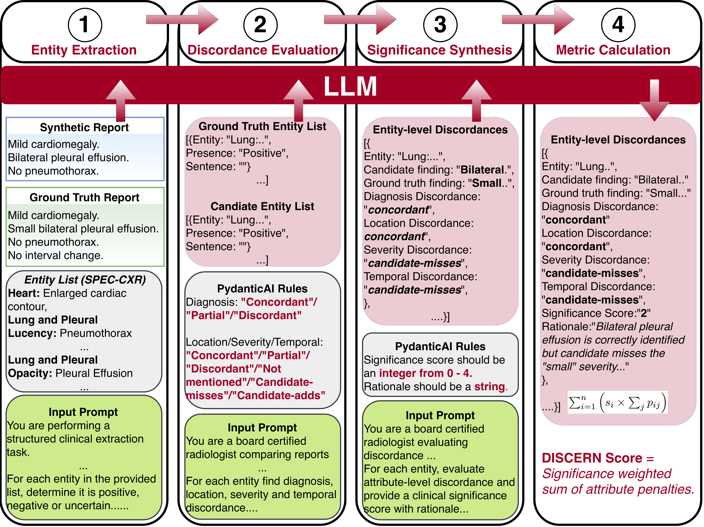

# DISCERN: Clinical Impact-Aware Framework for Radiology Report Comparison

<p align="center">
  
</p>

**DISCERN** is an LLM-powered evaluation framework designed to assess the clinical accuracy of AI-generated radiology reports by comparing them against radiologist-authored ground truth reports. Unlike traditional NLP metrics (BLEU, ROUGE, BERTScore), DISCERN operates at the *clinical entity level*, capturing diagnostically meaningful discrepancies and weighting them by their clinical significance — providing evaluation scores that align with how radiologists actually judge report quality.

---

## Table of Contents

- [Motivation](#motivation)
- [How DISCERN Works](#how-discern-works)
- [Repository Structure](#repository-structure)
- [Entity Taxonomy](#entity-taxonomy)
- [Scoring System](#scoring-system)
- [Installation](#installation)
- [Configuration](#configuration)
- [Usage](#usage)
- [Evaluation and Benchmarking](#evaluation-and-benchmarking)
- [Supported LLM Backends](#supported-llm-backends)
- [Citation](#citation)
- [License](#license)

---

## Motivation

Automated radiology report generation is a rapidly growing area of medical AI. However, evaluating these generated reports remains a significant challenge. Standard NLP metrics focus on surface-level text similarity and fail to capture what matters most in clinical practice: whether the generated report conveys the same diagnostic information as the ground truth, and how clinically consequential any discrepancies are.

DISCERN addresses this gap by introducing an evaluation framework that:

- Extracts structured clinical entities from both the reference and candidate reports.
- Compares entities across multiple clinical dimensions (diagnosis, location, severity, temporal change).
- Assigns clinical significance scores (0–4) to each discrepancy based on potential patient impact.
- Produces a single composite penalty score (the **DISCERN score**) that reflects the overall clinical divergence.

---

## How DISCERN Works

<p align="center">
  
</p>

DISCERN evaluates a candidate radiology report against a ground truth report through a multi-stage pipeline, with each stage leveraging LLM-based structured extraction and validation:

1. **Section Parsing** — The raw radiology report is segmented into standardized sections (history, technique, comparison, findings, impression) using a local Hugging Face model.

2. **Entity Extraction** — Clinical entities (e.g., "Pneumonia", "Pleural Effusion", "Rib Fracture") are identified in both the reference and candidate reports, along with their presence status (POSITIVE, NEGATIVE, UNCERTAIN).

3. **Attribute Comparison** — For entities present in both reports, the framework evaluates concordance across four clinical dimensions:
   - **Diagnosis concordance** — Does the candidate report agree on the diagnostic interpretation?
   - **Location concordance** — Are anatomical locations consistent?
   - **Severity concordance** — Do severity assessments match?
   - **Temporal comparison** — Are temporal characterizations (new, stable, worsening) aligned?

4. **Discrepancy Identification** — Entities present in only one report are flagged as either `missing_in_candidate` (omissions) or `extra_in_candidate` (false predictions).

5. **Clinical Significance Scoring** — Each entity receives a significance score from 0 to 4, reflecting the potential clinical impact of any discrepancy.

6. **DISCERN Score Computation** — Entity-level penalties are aggregated into a final score that quantifies the overall clinical divergence between the two reports.

---

## Repository Structure

```
discern/
├── README.md
├── setup.py                               # Package installation configuration
├── requirements.txt                       # Python dependencies
├── config/
│   ├── attribute_extraction_prompt.yaml   # Prompt template for attribute comparison
│   ├── diagnosis_only.yaml                # Diagnosis-level entity taxonomy
│   ├── entities.yaml                      # Full entity taxonomy (findings + diagnoses)
│   ├── entity_extraction_prompt.yaml      # Prompt template for entity extraction
│   ├── findings_only.yaml                 # Findings-level entity taxonomy
│   ├── section_parsing_prompt.yaml        # Prompt template for report section parsing
│   └── significance_prompt.yaml           # Prompt template for clinical significance scoring
├── data/
│   ├── discern_figure1.png                # Framework overview figure
│   └── discern_figure2.png                # Pipeline detail figure
├── src/                                   # Core DISCERN pipeline modules
│   ├── __init_.py
│   ├── call_llm.py                        # LLM interface (Databricks + Hugging Face)
│   ├── evaluate_reports.py                # End-to-end evaluation orchestrator
│   ├── evaluate_significance.py           # Clinical significance scoring module
│   ├── extract_entities.py                # Entity extraction with structured validation
│   ├── generate_attributes.py             # Attribute concordance comparison module
│   ├── get_discern_score.py               # DISCERN score computation and aggregation
│   ├── section_parsing.py                 # Report section parsing (local HF models)
│   └── utils.py                           # Entity merging and helper utilities
└── inference/                             # Benchmarking and comparison scripts
    ├── green_eval_radeval_rexval.py        # GREEN metric evaluation comparison
    ├── inference_radeval.py               # RadEvalX inference runner
    ├── inference_rexval.py                # ReXVal inference runner
    ├── nlp_metrics_eval_radevalx.py       # NLP metrics evaluation on RadEvalX
    ├── nlp_metrics_eval_rexval.py         # NLP metrics evaluation on ReXVal
    ├── radevalx_metric_calculator.py      # RadEvalX metric computation
    ├── rexval_metric_calculator.py        # ReXVal metric computation
    ├── run_radevalx_comparison.py         # Full RadEvalX benchmark comparison pipeline
    └── run_rexval_comparison.py           # Full ReXVal benchmark comparison pipeline
```

---

## Entity Taxonomy

DISCERN uses a comprehensive, hierarchically organized taxonomy of **121 chest X-ray entities** spanning 30 categories. The taxonomy is split into two levels:

### Findings-Level Entities

Radiographic observations and anatomical abnormalities, including:

- **Quality of Exams** — Suboptimal penetration, inspiration, body rotation, etc.
- **Tubes and Lines** — Endotracheal tubes, central venous catheters, chest tubes, etc.
- **Lung and Pleural Opacity** — Nodules, atelectasis, airspace opacity, pleural effusion, etc.
- **Lung and Pleural Lucency** — Emphysema, pneumothorax, bronchiectasis, etc.
- **Cardiac/Vascular** — Enlarged cardiac contour, aortic dilatation, pulmonary artery enlargement, etc.
- **Musculoskeletal** — Rib/clavicle/spine fractures, degenerative changes, bone density abnormalities, etc.

### Diagnosis-Level Entities

Clinical diagnoses and disease categories, including:

- **Infectious Disease** — Pneumonia, tuberculosis
- **Neoplasm** — Primary lung malignancy, pulmonary metastases
- **Cardiac Disease** — Congestive heart failure, valvular disease, pericardial disease
- **Pulmonary Disease** — ILD, COPD, pulmonary edema, ARDS, pulmonary hypertension, etc.
- **Aortic Disease** — Aortic dissection/aneurysm

The full taxonomy is defined in [`config/entities.yaml`](config/entities.yaml), with subsets available in [`config/findings_only.yaml`](config/findings_only.yaml) and [`config/diagnosis_only.yaml`](config/diagnosis_only.yaml).

---

## Scoring System

### Concordance Labels

Each shared entity is evaluated across four dimensions, with each assigned one of:

| Label | Meaning |
|---|---|
| `concordant` | Reports agree on this dimension |
| `partial` | Partial agreement with minor differences |
| `discordant` | Reports disagree |
| `candidate-adds` | Candidate report adds information not in the reference |
| `candidate-misses` | Candidate report omits information present in the reference |
| `not mentioned` | Dimension not applicable to this entity |

### Clinical Significance Scale (0–4)

| Score | Interpretation |
|---|---|
| **0** | No meaningful clinical impact; fully concordant entity |
| **1** | Low significance; incidental or chronic/stable discrepancy |
| **2** | Moderate relevance; may affect follow-up or differential diagnosis |
| **3** | Important discrepancy likely to affect treatment or near-term workup |
| **4** | Critical, time-sensitive discrepancy likely to change immediate management |

### DISCERN Score

The final DISCERN score for a report pair is computed as the sum of per-entity penalties:

```
Entity Penalty = significance_score × raw_penalty
```

Where `raw_penalty` is the count of discordant dimensions (diagnosis, location, severity, temporal) for that entity. Higher DISCERN scores indicate greater clinical divergence between the candidate and reference reports.

---

## Installation

### Prerequisites

- Python 3.8+
- Access to a Databricks serving endpoint (for cloud LLM inference) **or** a local GPU for Hugging Face models
- An API token for your chosen LLM backend

### Setup

```bash
git clone https://github.com/rakshrma/discern.git
cd discern
```

**Option 1 — Install with pip (recommended):**

```bash
# Core pipeline only
pip install .

# Core + benchmarking dependencies
pip install ".[inference]"

# Everything
pip install ".[all]"
```

**Option 2 — Install from requirements.txt:**

```bash
pip install -r requirements.txt
```

> **Note:** The [GREEN](https://github.com/Stanford-AIMI/GREEN) metric package is not available on PyPI. If you need GREEN evaluation, install it separately from the Stanford AIMI repository.

### Token Configuration

Place your API tokens in the `config/` directory:

- **Databricks**: Save your token to `config/.databricks.token`
- **Hugging Face**: Save your token to `config/.hftoken`

---

## Configuration

All prompts and entity definitions are stored as YAML files in the `config/` directory. You can customize the evaluation by modifying:

| File | Purpose |
|---|---|
| `entities.yaml` | Full entity taxonomy (modify to add/remove entities) |
| `findings_only.yaml` | Findings-only subset of the taxonomy |
| `diagnosis_only.yaml` | Diagnosis-only subset of the taxonomy |
| `entity_extraction_prompt.yaml` | LLM prompt for extracting entities from reports |
| `attribute_extraction_prompt.yaml` | LLM prompt for comparing attributes between reports |
| `significance_prompt.yaml` | LLM prompt for assigning clinical significance scores |
| `section_parsing_prompt.yaml` | Prompt for parsing report sections (local model) |

---

## Usage

### End-to-End Report Evaluation

The primary entry point is `src/evaluate_reports.py`, which orchestrates the full pipeline and returns both the per-entity evaluation and the aggregate DISCERN score:

```python
from src.evaluate_reports import run_evaluation

discern_evaluation, discern_score = run_evaluation(
    report_text="FINDINGS: The heart is normal in size...",          # Ground truth report
    candidate_text="FINDINGS: The heart appears enlarged...",        # AI-generated report
    model="databricks-claude-sonnet-4-5",                        # LLM model name
    token_path="config/.databricks.token",                          # API token path
    prompt_yaml_path="config/entity_extraction_prompt.yaml",        # Entity extraction prompt
    entities_yaml_path="config/entities.yaml",                      # Entity taxonomy
    attribute_prompt_path="config/attribute_extraction_prompt.yaml", # Attribute comparison prompt
    significance_yaml_path="config/significance_prompt.yaml",       # Significance scoring prompt
)

print(f"DISCERN Score: {discern_score}")
```

The `discern_evaluation` is a list of dictionaries, one per entity, each containing:

```python
{
    "entity": "Heart :: Enlarged Cardiac Contour",
    "reference_report_finding": "The heart is normal in size.",
    "candidate_report_finding": "The heart appears enlarged.",
    "diagnosis_concordance": "discordant",
    "location_concordance": "concordant",
    "severity_concordance": "candidate-adds",
    "temporal_comparison": "not mentioned",
    "significance_score": 3,
    "rationale": "Mischaracterizing cardiac size may alter workup..."
}
```

### Computing the DISCERN Score from CSV

If you have evaluation results saved as a CSV, compute the aggregate DISCERN score with:

```python
from src.get_discern_score import process_csv

df = process_csv(
    input_path="path/to/evaluation_results.csv",
    findings_column="discern_eval",
)
print(df[["discern_score"]].describe())
```

Or process all CSV files in a directory:

```python
from src.get_discern_score import process_directory

results = process_directory(
    directory="path/to/results/",
    findings_column="discern_eval",
)
```

### Section Parsing (Local Model)

To parse a raw radiology report into structured sections using a local Hugging Face model:

```python
from src.section_parsing import run_single_report

status, raw_output, sections = run_single_report(
    model="your-hf-model-name",
    prompt_yaml="config/section_parsing_prompt.yaml",
    report_text="HISTORY: Chest pain. FINDINGS: Clear lungs...",
)

print(sections.findings)
print(sections.impression)
```

---

## Evaluation and Benchmarking

DISCERN includes comprehensive comparison scripts (in the `inference/` directory) for benchmarking against established radiology report evaluation methods:

- **ReXVal** — Radiologist expert validation benchmark 
- **RadEvalX** — Radiology evaluation benchmark 
- **GREEN** — Generative radiology report evaluation 
- **NLP Metrics** — BLEU, ROUGE, BERTScore, and other traditional metrics

These scripts compute correlation statistics (Kendall's tau, Spearman's rho) between DISCERN scores and expert radiologist annotations, demonstrating alignment with clinical judgment.

---

## Supported LLM Backends

DISCERN supports two inference backends:

| Backend | Use Case | Configuration |
|---|---|---|
| **Databricks Serving Endpoints** | Cloud-based LLM inference (Claude, GPT, etc.) | Set token in `config/.databricks.token` |
| **Hugging Face Transformers** | Local GPU inference for open-source models | Set token in `config/.hftoken` |

The backend is automatically selected based on the model name: models prefixed with `databricks-` route to the Databricks endpoint; all others use the local Hugging Face pipeline.

---

## Citation

If you use DISCERN in your research, please cite:

```bibtex
@article{sharma2025discern,
  title={DISCERN: A Clinical Impact-Aware Framework for Radiology Report Comparison},
  author={Sharma, Rakesh and Beeche, Cameron and Dong, Jessie and Zhuang, Richard and Qu, Huaizhi and Zhang, Ruichen and Gangaram, Vineeth and Goswami, Pulak and Xin, Jiayi and Ballard, Jenna and Goldberg, Ari and Sagreiya, Hersh and Long, Qi and Chen, Tianlong and Witschey, Walter}
}
```

---

## License


---

## Acknowledgments
